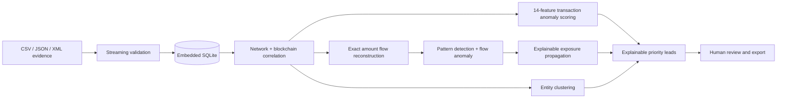

<div align="center">
  

  <h1>Satoshi Trace</h1>

  <p><strong>Port-free, offline Bitcoin blockchain and network forensics.</strong></p>

  <p>
    Ingest evidence. Correlate layers. Cluster entities. Prioritize explainable leads.<br>
    Everything runs locally, without a web server or runtime internet dependency.
  </p>

  <p>
    
    <a href="https://github.com/calebjubal/crypto-forensics/releases"></a>
    
    
  </p>

  <p>
    
    
    
    
    
    
  </p>

  <p>
    <a href="https://github.com/calebjubal/crypto-forensics/releases/latest"><strong>Download</strong></a>
    ·
    <a href="#quick-start"><strong>Quick start</strong></a>
    ·
    <a href="#evidence-schema"><strong>Evidence schema</strong></a>
    ·
    <a href="#security-and-offline-boundary"><strong>Security</strong></a>
    ·
    <a href="CHANGELOG.md"><strong>Changelog</strong></a>
  </p>
</div>

---

Satoshi Trace is an offline Electron desktop application for investigators working with integrated Bitcoin transaction and network-observation metadata. It streams bulk CSV, JSON, and XML evidence into an embedded SQLite case database, correlates blockchain and network layers by transaction ID, detects unusual transactions and conservative flow-pattern hypotheses, creates entity hypotheses, propagates explainable exposure from high-confidence automatic pattern seeds, and produces prioritized leads with human-readable explanations.

> [!IMPORTANT]
> Scores, clusters, flow patterns, propagated exposure, and network correlations are investigative hypotheses—not proof of identity, laundering, ownership, or wrongdoing. Every result requires human review and corroboration.

## Highlights

- **Completely offline deployment** — no HTTP server, localhost port, remote model, CDN, telemetry, updater, online tiles, font, ASN lookup, or runtime download.
- **Bulk evidence ingestion** — select multiple files together, add more later, review rejected rows, and safely remove individual sources.
- **Three evidence formats** — CSV, JSON, and XML are parsed as streams instead of loading entire source files into memory.
- **Cross-layer correlation** — joins IP, port, time, geography, and ASN observations to Bitcoin TXIDs, addresses, and amounts.
- **Graph-aware local AI/ML analysis** — bundled transaction- and flow-level Isolation Forest models measure relative unusualness without contacting an external service.
- **Conservative flow analysis** — exact wallet-and-satoshi links support peeling-chain and directly linked mixing-cascade hypotheses with explicit ambiguity and hub safeguards.
- **Explainable exposure** — only high-confidence automatic pattern hypotheses seed four-hop forward risk, with the strongest saved path and a disclosed decay formula.
- **Conservative entity clustering** — common-input ownership is supplemented by deterministic transaction-graph embeddings with repeated-context, similarity, and size safeguards.
- **Interactive entity graphs** — bundled Cytoscape views map address participation to related transactions with ring and flow layouts.
- **Transaction world map** — a bundled Natural Earth outline and DB-IP City Lite database show full-case city routes, then reveal a selected lead's IP, transaction, and wallet path.
- **Custom cluster colors** — stable contrast-safe defaults and per-investigator overrides apply across the world map and entity graphs.
- **Explainable lead triage** — Critical, High, Medium, and Low priorities include the measured reasons behind each score.
- **Evidence provenance** — every source records its SHA-256 digest, byte size, ingestion time, and row outcomes.
- **Local authentication and audit trail** — salted scrypt password hashes protect entry, while operations are recorded in the case database.
- **Resilient desktop UI** — user-triggered failures appear as toasts and preserve the current dashboard view.
- **Host connectivity awareness** — a request-free red/green badge reports the operating system's connectivity signal while application transport remains blocked.
- **Local exports** — investigative leads can be exported as JSON or formula-safe CSV.

## Quick start

### Install a release

1. Open the [releases page](https://github.com/calebjubal/crypto-forensics/releases).
2. Download the distributable for the target operating system.
3. Transfer it to the offline workstation using your approved evidence-handling process.
4. Install and launch Satoshi Trace.
5. Create the first local investigator account. There is no password-recovery service, so retain the credentials securely.

The historic `v1.0.3` release uses Squirrel metadata. New source builds use Electron Builder and should be created on the destination operating system or a compatible CI runner.

### Run from source

Building from source requires internet access once to obtain npm dependencies. After packaging, the deployed application does not require Node.js or internet access.

```powershell
git clone https://github.com/calebjubal/crypto-forensics.git
cd crypto-forensics
npm ci
npm start
```

## Investigation workflow



1. **Authenticate** with the local investigator account.
2. **Import** one or many evidence files from local storage.
3. **Review provenance** and rejected-row explanations in the source ledger.
4. **Run analysis** to rebuild anomaly scores, exact flow links, flow patterns, exposure paths, entity clusters, and leads.
5. **Investigate** transactions, correlated observations, feature evidence, flow-pattern and exposure hypotheses, clustering hypotheses, and the full-case transaction map.
6. **Record disposition** and case notes for each lead.
7. **Export** selected investigative results to a local JSON or CSV report.

## Evidence schema

Each integrated record correlates both layers through `txid`.

| Field                | Type              | Requirement                                                  |
| -------------------- | ----------------- | ------------------------------------------------------------ |
| `timestamp`          | string            | ISO 8601 timestamp with seconds and an explicit timezone     |
| `src_ip`             | string            | Valid IPv4 or IPv6 address                                   |
| `dst_ip`             | string            | Valid IPv4 or IPv6 address                                   |
| `src_port`           | integer           | `0`–`65535`                                                  |
| `dst_port`           | integer           | `0`–`65535`                                                  |
| `txid`               | string            | Exactly 64 hexadecimal characters                            |
| `input_addresses[]`  | string array      | One to 10,000 address identifiers                            |
| `output_addresses[]` | string array      | One to 10,000 address identifiers                            |
| `input_amounts[]`    | decimal array     | BTC values with no more than eight decimal places            |
| `output_amounts[]`   | decimal array     | BTC values with no more than eight decimal places            |
| `geo_country`        | string            | Supplied country metadata; required when `asn` is absent     |
| `asn`                | string or integer | Supplied ASN metadata; required when `geo_country` is absent |

Amounts are converted exactly and stored as integer satoshis. Aggregate totals are returned as decimal strings when necessary so valid case totals cannot overflow JavaScript's safe integer range.

### Supported formats

| Format | Expected structure                         | Array representation                  |
| ------ | ------------------------------------------ | ------------------------------------- |
| CSV    | One evidence record per row                | JSON array text inside each list cell |
| JSON   | Top-level array of evidence objects        | Native JSON arrays                    |
| XML    | `<records>` containing `<record>` elements | Repeated `<item>` children            |

Minimal JSON example:

```json
[
  {
    "timestamp": "2026-01-15T10:30:00Z",
    "src_ip": "192.0.2.10",
    "dst_ip": "198.51.100.25",
    "src_port": 49152,
    "dst_port": 8333,
    "txid": "0123456789abcdef0123456789abcdef0123456789abcdef0123456789abcdef",
    "input_addresses": ["bc1q-input-example"],
    "output_addresses": ["bc1q-output-example"],
    "input_amounts": ["1.25000000"],
    "output_amounts": ["1.24990000"],
    "geo_country": "US",
    "asn": "64500"
  }
]
```

The IP addresses, ASN, addresses, and TXID above are documentation placeholders and not production evidence.

## Analysis and explainability

Analysis is deterministic for a given case database and bundled rule version. The application saves the feature vector, model configuration, thresholds, baseline measurements, score, category, and explanations used for every lead.

Priority thresholds:

| Priority |  Score |
| -------- | -----: |
| Critical | 75–100 |
| High     |  50–74 |
| Medium   |  25–49 |
| Low      |   0–24 |

The transaction Isolation Forest uses 14 saved features: output value, fee ratio, input/output counts, observation/source counts, observation span, source-minute burst, upstream/downstream transaction degree, reused-input count, equal-output concentration, largest-output share, and continuation ratio. Its score expresses relative unusualness within the imported dataset; it is not a probability of criminal activity. Rule explanations identify the observations contributing to triage, while the transaction view retains the underlying network records and source provenance for review.

Flow reconstruction normalizes input/output wallet identifiers and integer satoshi amounts into indexed temporary tables in bounded batches. An output links to a later input only when wallet identifier and amount match exactly, the first-observed timestamp is strictly later, neither side is ambiguous, and the wallet identifier occurs no more than 100 times in the matching table. Ambiguous output/input matches, high-degree identifiers, and timestamp conflicts are counted in the saved analysis configuration and JSON report rather than silently accepted. First-observed network timestamps are not authoritative block times.

Peeling-chain hypotheses contain 3–20 non-CoinJoin transactions. Each continuation step has 2–5 outputs, carries 70–99.5% of value through an exact link, leaves a 0.5–30% remainder, and advances monotonically in first-observed time. Confidence starts at 70 and can add up to 15 for length and 15 for continuation consistency. A CoinJoin-like transaction still uses the existing ≥3-input/≥3-equal-output structural rule, but one transaction is caution-only, contributes zero points, and never seeds risk. A mixing cascade requires at least two CoinJoin-like transactions connected by a direct exact flow link; its confidence starts at 70 and can add up to 15 for linked mixes and 15 for equal-output concentration.

When at least 32 flow patterns exist, a separate deterministic Isolation Forest scores sequence length, wallet footprint, value, duration, continuation consistency, equal-output concentration, and branching. Below 32 patterns, the UI and exports explicitly show that flow anomaly is unavailable while retaining structural confidence.

Only detected peeling chains and mixing cascades at confidence 70 or above become automatic suspected-pattern seeds. No manual or bundled illicit-wallet list is used. Final-pattern exit wallets receive the pattern confidence, then exposure travels forward for at most four transaction hops using `next risk = current risk × 0.65 × sqrt(output amount / transaction output total)`. The strongest path per wallet is retained, cycles are prevented, and propagation stops below risk 10. A transaction receives the highest risk of its input wallets. Exposure remains a separate 0–100 value and contributes `round(risk × 0.30)` to lead score, capped at 30. Structural membership contributes at most once: +25 for peeling or +20 for mixing. Final lead score remains capped at 100.

The Flow Analysis screen presents peeling, CoinJoin-caution, mixing, automatic-seed, and exposed-wallet totals alongside searchable type/confidence/anomaly/risk filters. Selecting a pattern isolates it and animates a compact directed Cytoscape graph to fit. Amber solid edges indicate peeling structure, dashed violet indicates linked mixes, and red edge thickness reflects propagated exposure. Nodes are draggable, the viewport is pannable and zoomable, keyboard-accessible node controls mirror the canvas, and double-clicking a transaction opens evidence. Detail views cap rendering at 120 transactions, 160 wallets, and 600 edges, using labelled overflow nodes while retaining full saved results and export counts.

Entity clusters begin with the common-input heuristic as a conservative ownership hypothesis, excluding possible collaborative transactions. The offline analytics worker then creates deterministic 32-dimensional embeddings of each wallet's input/output transaction neighborhood. Separate common-input components are linked only when both later appear as inputs, share at least two non-collaborative output contexts, reach cosine similarity of at least 0.82, and remain within a 100-wallet cap. A generic structural resemblance, a single co-occurrence, IP data, geography, ASN metadata, and guessed change addresses cannot merge wallets. These safeguards reduce—not eliminate—false associations.

The Entity Clusters screen summarizes total hypotheses, grouped wallets, graph-assisted groups, and the largest group before presenting a ranked visual catalog. Each card distinguishes common-input-only from graph-assisted hypotheses, compares wallet footprint and transaction activity within the visible page, and discloses embedding-link counts. Opening a cluster renders an interactive address-to-transaction evidence graph. Investigators can switch between concentric rings and a transaction-first flow, fit the graph to the viewport, select nodes for context, and open a transaction from the graph. Address, embedding-link, and transaction evidence remain available below the visualization, while large clusters use disclosed node and edge caps to keep interaction responsive.

The Priority Leads page aggregates every imported observation into dotted source-city-to-destination-city routes, grouped by the transaction's common-input cluster. It retains observation, transaction, unique-IP, flagged-lead, and cluster totals even when several observations share one rendered edge. Above 2,000 route/cluster groups, low-volume groups are consolidated by city pair with totals and cluster breakdowns retained. Selecting a lead hides the overview and shows only its bold, curved source IP, destination IP, transaction, and input/output-wallet path; source and destination markers remain at their approximate GeoIP coordinates, with only small collision offsets for shared locations. Transaction and wallet nodes are logical relationships rather than physical locations. Selecting the same lead again restores every route. Investigators can drag the map, zoom with a wheel or pinch gesture, and use the accessible zoom/reset controls. Zoom-out stops at the full-world extent, vertical panning is bounded, and horizontal panning wraps continuously across the Pacific seam without exposing empty canvas. Focus views disclose overflow above 120 endpoints, 120 wallets, or 800 edges with labelled count nodes.

IPv4 and IPv6 locations are inferred locally from the bundled DB-IP City Lite September 2026 database. These city and coordinate results are approximate visualization metadata and are never written into evidentiary tables. Private, reserved, documentation, and unmatched addresses use supplied `geo_country` only as a labelled country-centroid fallback; otherwise they remain unlocated. Derived and supplied country disagreements are preserved as metadata rather than silently reconciled. City Lite does not provide or infer ISP, domain, connection type, postal code, or an accuracy radius.

## Evidence and file management

- Import multiple supported files in a single selection.
- Add further files at any point in the investigation.
- Track source name, format, SHA-256, size, row totals, accepted rows, duplicates, rejected rows, and ingestion timestamp.
- Inspect validation reasons without discarding successfully ingested evidence.
- Remove a source without deleting the original file from disk.
- Preserve observations supported by another imported source.
- Clear derived leads, clusters, exact flow links, patterns, seeds, and exposure paths after evidence removal until analysis is run again.

## Security and offline boundary

The packaged application loads bundled `file://` assets directly and does not create an application listener on TCP or UDP.

- Socket, HTTP(S), TLS, UDP, DNS, WebSocket, and `fetch` APIs are denied in the application runtime.
- Chromium background networking, remote navigation, downloads, permissions, remote windows, and non-proxied WebRTC UDP are blocked.
- A restrictive Content Security Policy permits only bundled local assets.
- Electron context isolation is enabled and the renderer receives a narrow IPC bridge.
- Electron fuses disable `RunAsNode`, Node CLI inspection, and `NODE_OPTIONS`, while enforcing ASAR integrity and ASAR-only loading.
- Evidence parsing and analysis run in a local worker thread.
- SQLite, parsers, ML code, Cytoscape, CSS, the Natural Earth outline, DB-IP City Lite, and icons are bundled; the interface uses local system fonts and never downloads a web font.
- UNC and network-share evidence paths are rejected.
- Passwords are stored only as salted scrypt hashes.
- The audit log records application lifecycle, authentication, navigation, imports, removal, analysis, review, export, cancellation, and failures.

For defense in depth, deploy on a disconnected workstation and enforce the organization’s operating-system firewall and evidence-handling controls. Satoshi Trace cannot govern unrelated processes running on the host.

## Technology

| Layer              | Implementation                                            |
| ------------------ | --------------------------------------------------------- |
| Desktop runtime    | Electron 44                                               |
| Interface          | HTML, Tailwind CSS 4, daisyUI 5, Anime.js, Cytoscape.js   |
| Local storage      | Embedded SQLite with WAL and `synchronous=FULL`           |
| Ingestion          | Streaming CSV, JSON, and SAX-style XML parsers            |
| Analytics          | Explainable rules, exact flow graph, and two bundled JavaScript Isolation Forest models |
| Geolocation        | Bundled DB-IP City Lite MMDB; session-only IP cache        |
| Map                | Natural Earth 1:110m outline with Cytoscape overlays       |
| Internal transport | Electron IPC and worker messages only                     |
| Packaging          | Electron Builder with ASAR and hardened Electron fuses    |

Tailwind and daisyUI are build-time dependencies. `npm run build:css` generates `assets/app.css`, which is included in the application archive; the CSS toolchain is not required on deployed workstations.

## Development

```powershell
npm ci
npm run build:css
npm test
npm run package
```

Useful scripts:

| Command           | Purpose                                                                                                |
| ----------------- | ------------------------------------------------------------------------------------------------------ |
| `npm start`       | Build local CSS and launch Electron in development mode                                                |
| `npm test`        | Run the ingestion, authentication, analysis, deletion, export-safety, and large-value regression tests |
| `npm run package` | Create an unpacked application for the current platform                                                |
| `npm run make`    | Create the configured distributable for the current platform                                           |
| `npm run verify`  | Run the full test suite and package the application                                                    |
| `npm run publish` | Build CSS and publish configured Electron Builder artifacts to GitHub Releases                         |

## Distributables

Build each operating-system package on that operating system or a compatible CI runner.

| Target                 | Electron Builder target | Typical artifact                     |
| ---------------------- | ----------------------- | ------------------------------------ |
| Windows                | NSIS and portable       | Setup `.exe` and portable `.exe`     |
| Debian / Ubuntu family | DEB                     | `.deb` package                       |
| Fedora / RHEL family   | RPM                     | `.rpm` package                       |
| Linux (portable)       | AppImage                | `.AppImage`                          |

```powershell
# Current host package
npm run package

# Current host distributable
npm run make
```

### Draft GitHub release workflow

The `Update draft release` workflow follows electron-builder's recommended GitHub release process:

1. Set the intended version in `package.json` and `package-lock.json`.
2. Create a draft GitHub release whose tag is that version prefixed with `v`, such as `v1.0.5`.
3. Push release-candidate commits to `dev`, or run the workflow manually.
4. CI verifies that exactly one matching draft exists, runs the test suite, and builds Windows and Linux artifacts without allowing electron-builder to publish them independently.
5. A final serialized job replaces the draft assets only after every platform build succeeds.
6. Publish the draft from GitHub only after the artifacts have been reviewed.

The workflow and `npm run publish` both refuse to upload when the matching release is missing, duplicated, already public, targeted at another branch, or associated with a Git tag that points to different source. They build with electron-builder publishing disabled, then perform one draft upload through GitHub CLI to prevent targets from racing to create duplicate releases. Configure `WIN_CSC_LINK` and `WIN_CSC_KEY_PASSWORD` repository secrets for Windows signing. With signing secrets absent, electron-builder can still create unsigned Windows test artifacts; Linux packages do not require a code-signing identity.

Production installers should be signed with the platform owner’s trusted code-signing identity before distribution. Signing credentials must remain outside the repository and should be supplied through the secured build environment.

## Project structure

```text
assets/                 Compiled CSS, icons, world outline, and GeoIP data
src/analytics.js        Feature extraction, scoring, and clustering
src/database.js         SQLite schema, provenance, queries, and authentication
src/flow-analysis.js    Exact flow links, patterns, flow anomaly, and exposure paths
src/isolation-forest.js Bundled anomaly model
src/geolocation.js      Offline City Lite lookup and country fallback
src/map.js              Bounded overview and focused map projections
src/offline.js          Runtime network-denial boundary
src/parsers.js          Streaming CSV, JSON, and XML ingestion
src/validation.js       Evidence schema and exact amount validation
src/worker.js           Local evidence and analytics worker
test/                   System and regression tests
.github/workflows/      Draft-release validation and cross-platform builds
main.js                 Electron main process and trusted IPC handlers
preload.js              Context-isolated renderer bridge
renderer.js             Dashboard behavior and toast-based error handling
styles.input.css        Tailwind and daisyUI theme source
```

## Operational limitations

- Supplied country and ASN values are not independently verified; City Lite locations are approximate and may be wrong or stale.
- NAT, relays, VPNs, shared infrastructure, incomplete collection, and clock differences can weaken network-layer attribution.
- A location/IP route never proves wallet ownership, identity, control, or physical presence.
- Batching, consolidation, large transfers, fees, and collaborative transactions can have legitimate explanations.
- Common-input and graph-embedding clustering can produce false associations and must be treated as a hypothesis.
- Address reuse and exact address/amount matching do not establish ownership or an authoritative blockchain spend relationship when source metadata is incomplete.
- CoinJoin-like structure, peeling patterns, mixing cascades, anomaly, and propagated exposure do not prove laundering or illicit status.
- Deleting or losing the local case database removes its accounts, evidence, reviews, and audit history.
- There is intentionally no cloud backup, synchronization, telemetry, or password-recovery service.

## Contributing

1. Create a focused branch.
2. Keep all production functionality compatible with fully offline deployment.
3. Add or update regression coverage for behavioral changes.
4. Run `npm test` and `npm run package` before submitting changes.
5. Never commit case evidence, credentials, signing material, or generated private reports.

Security-sensitive findings should not include real evidence in public issues. Share only sanitized reproduction steps.

## License

The package metadata declares this project under the ISC license. See [`package.json`](package.json) for the current project metadata and [`THIRD_PARTY_NOTICES.md`](THIRD_PARTY_NOTICES.md) for bundled DB-IP City Lite attribution, Natural Earth terms, and dependency notices.

---

<div align="center">
  <strong>Satoshi Trace</strong><br>
  Local evidence. Explainable leads. No network transport.
</div>
