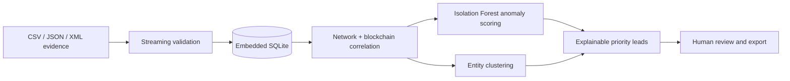

<div align="center">
  

  <h1>Satoshi Trace</h1>

  <p><strong>Port-free, offline Bitcoin blockchain and network forensics.</strong></p>

  <p>
    Ingest evidence. Correlate layers. Cluster entities. Prioritize explainable leads.<br>
    Everything runs locally, without a web server or runtime internet dependency.
  </p>

  <p>
    <a href="https://github.com/calebjubal/crypto-forensics/releases/tag/v1.0.2"></a>
    <a href="https://github.com/calebjubal/crypto-forensics/releases"></a>
    
    
  </p>

  <p>
    
    
    
    
    
    
  </p>

  <p>
    <a href="https://github.com/calebjubal/crypto-forensics/releases/latest"><strong>Download</strong></a>
    ·
    <a href="#quick-start"><strong>Quick start</strong></a>
    ·
    <a href="#evidence-schema"><strong>Evidence schema</strong></a>
    ·
    <a href="#security-and-offline-boundary"><strong>Security</strong></a>
    ·
    <a href="CHANGELOG.md"><strong>Changelog</strong></a>
  </p>
</div>

---

Satoshi Trace is an offline Electron desktop application for investigators working with integrated Bitcoin transaction and network-observation metadata. It streams bulk CSV, JSON, and XML evidence into an embedded SQLite case database, correlates blockchain and network layers by transaction ID, detects unusual activity, creates conservative entity hypotheses, and produces prioritized leads with human-readable explanations.

> [!IMPORTANT]
> Scores, clusters, and network correlations are investigative hypotheses—not proof of identity, ownership, or wrongdoing. Every result requires human review and corroboration.

## Highlights

- **Completely offline deployment** — no HTTP server, localhost port, remote model, CDN, telemetry, updater, map, font, ASN lookup, or runtime download.
- **Bulk evidence ingestion** — select multiple files together, add more later, review rejected rows, and safely remove individual sources.
- **Three evidence formats** — CSV, JSON, and XML are parsed as streams instead of loading entire source files into memory.
- **Cross-layer correlation** — joins IP, port, time, geography, and ASN observations to Bitcoin TXIDs, addresses, and amounts.
- **Local AI/ML analysis** — a bundled Isolation Forest measures relative unusualness without contacting an external service.
- **Conservative entity clustering** — common-input ownership hypotheses exclude possible collaborative transactions.
- **Interactive entity graphs** — bundled Cytoscape views map address participation to related transactions with ring and flow layouts.
- **Explainable lead triage** — Critical, High, Medium, and Low priorities include the measured reasons behind each score.
- **Evidence provenance** — every source records its SHA-256 digest, byte size, ingestion time, and row outcomes.
- **Local authentication and audit trail** — salted scrypt password hashes protect entry, while operations are recorded in the case database.
- **Resilient desktop UI** — user-triggered failures appear as toasts and preserve the current dashboard view.
- **Host connectivity awareness** — a request-free red/green badge reports the operating system's connectivity signal while application transport remains blocked.
- **Local exports** — investigative leads can be exported as JSON or formula-safe CSV.

## Quick start

### Install a release

1. Open the [releases page](https://github.com/calebjubal/crypto-forensics/releases).
2. Download the distributable for the target operating system.
3. Transfer it to the offline workstation using your approved evidence-handling process.
4. Install and launch Satoshi Trace.
5. Create the first local investigator account. There is no password-recovery service, so retain the credentials securely.

The published `v1.0.2` release contains the Windows installer and Squirrel package metadata. Linux packages are created separately on a compatible Linux build host.

### Run from source

Building from source requires internet access once to obtain npm dependencies. After packaging, the deployed application does not require Node.js or internet access.

```powershell
git clone https://github.com/calebjubal/crypto-forensics.git
cd crypto-forensics
npm ci
npm start
```

## Investigation workflow



1. **Authenticate** with the local investigator account.
2. **Import** one or many evidence files from local storage.
3. **Review provenance** and rejected-row explanations in the source ledger.
4. **Run analysis** to rebuild anomaly scores, entity clusters, and leads.
5. **Investigate** transactions, correlated observations, feature evidence, and clustering hypotheses.
6. **Record disposition** and case notes for each lead.
7. **Export** selected investigative results to a local JSON or CSV report.

## Evidence schema

Each integrated record correlates both layers through `txid`.

| Field                | Type              | Requirement                                                  |
| -------------------- | ----------------- | ------------------------------------------------------------ |
| `timestamp`          | string            | ISO 8601 timestamp with seconds and an explicit timezone     |
| `src_ip`             | string            | Valid IPv4 or IPv6 address                                   |
| `dst_ip`             | string            | Valid IPv4 or IPv6 address                                   |
| `src_port`           | integer           | `0`–`65535`                                                  |
| `dst_port`           | integer           | `0`–`65535`                                                  |
| `txid`               | string            | Exactly 64 hexadecimal characters                            |
| `input_addresses[]`  | string array      | One to 10,000 address identifiers                            |
| `output_addresses[]` | string array      | One to 10,000 address identifiers                            |
| `input_amounts[]`    | decimal array     | BTC values with no more than eight decimal places            |
| `output_amounts[]`   | decimal array     | BTC values with no more than eight decimal places            |
| `geo_country`        | string            | Supplied country metadata; required when `asn` is absent     |
| `asn`                | string or integer | Supplied ASN metadata; required when `geo_country` is absent |

Amounts are converted exactly and stored as integer satoshis. Aggregate totals are returned as decimal strings when necessary so valid case totals cannot overflow JavaScript's safe integer range.

### Supported formats

| Format | Expected structure                         | Array representation                  |
| ------ | ------------------------------------------ | ------------------------------------- |
| CSV    | One evidence record per row                | JSON array text inside each list cell |
| JSON   | Top-level array of evidence objects        | Native JSON arrays                    |
| XML    | `<records>` containing `<record>` elements | Repeated `<item>` children            |

Minimal JSON example:

```json
[
  {
    "timestamp": "2026-01-15T10:30:00Z",
    "src_ip": "192.0.2.10",
    "dst_ip": "198.51.100.25",
    "src_port": 49152,
    "dst_port": 8333,
    "txid": "0123456789abcdef0123456789abcdef0123456789abcdef0123456789abcdef",
    "input_addresses": ["bc1q-input-example"],
    "output_addresses": ["bc1q-output-example"],
    "input_amounts": ["1.25000000"],
    "output_amounts": ["1.24990000"],
    "geo_country": "US",
    "asn": "64500"
  }
]
```

The IP addresses, ASN, addresses, and TXID above are documentation placeholders and not production evidence.

## Analysis and explainability

Analysis is deterministic for a given case database and bundled rule version. The application saves the feature vector, model configuration, thresholds, baseline measurements, score, category, and explanations used for every lead.

Priority thresholds:

| Priority |  Score |
| -------- | -----: |
| Critical | 75–100 |
| High     |  50–74 |
| Medium   |  25–49 |
| Low      |   0–24 |

The Isolation Forest score expresses relative unusualness within the imported dataset; it is not a probability of criminal activity. Rule explanations identify the observations contributing to triage, while the transaction view retains the underlying network records and source provenance for review.

Entity clusters use the common-input heuristic as a conservative ownership hypothesis. Possible collaborative transactions are excluded from clustering, and IP addresses are never treated as proof of wallet ownership.

Opening a cluster renders an interactive address-to-transaction evidence graph. Investigators can switch between concentric rings and a transaction-first flow, fit the graph to the viewport, select nodes for context, and open a transaction from the graph. Complete address and transaction lists remain available below the visualization, while large clusters use disclosed node and edge caps to keep interaction responsive.

## Evidence and file management

- Import multiple supported files in a single selection.
- Add further files at any point in the investigation.
- Track source name, format, SHA-256, size, row totals, accepted rows, duplicates, rejected rows, and ingestion timestamp.
- Inspect validation reasons without discarding successfully ingested evidence.
- Remove a source without deleting the original file from disk.
- Preserve observations supported by another imported source.
- Clear derived leads and clusters after evidence removal until analysis is run again.

## Security and offline boundary

The packaged application loads bundled `file://` assets directly and does not create an application listener on TCP or UDP.

- Socket, HTTP(S), TLS, UDP, DNS, WebSocket, and `fetch` APIs are denied in the application runtime.
- Chromium background networking, remote navigation, downloads, permissions, remote windows, and non-proxied WebRTC UDP are blocked.
- A restrictive Content Security Policy permits only bundled local assets.
- Electron context isolation is enabled and the renderer receives a narrow IPC bridge.
- Electron fuses disable `RunAsNode`, Node CLI inspection, and `NODE_OPTIONS`, while enforcing ASAR integrity and ASAR-only loading.
- Evidence parsing and analysis run in a local worker thread.
- SQLite, parsers, ML code, Cytoscape, CSS, and icons are bundled; the interface uses local system fonts and never downloads a web font.
- UNC and network-share evidence paths are rejected.
- Passwords are stored only as salted scrypt hashes.
- The audit log records application lifecycle, authentication, navigation, imports, removal, analysis, review, export, cancellation, and failures.

For defense in depth, deploy on a disconnected workstation and enforce the organization’s operating-system firewall and evidence-handling controls. Satoshi Trace cannot govern unrelated processes running on the host.

## Technology

| Layer              | Implementation                                            |
| ------------------ | --------------------------------------------------------- |
| Desktop runtime    | Electron 44                                               |
| Interface          | HTML, Tailwind CSS 4, daisyUI 5, Anime.js, Cytoscape.js   |
| Local storage      | Embedded SQLite with WAL and `synchronous=FULL`           |
| Ingestion          | Streaming CSV, JSON, and SAX-style XML parsers            |
| Analytics          | Explainable rules and bundled JavaScript Isolation Forest |
| Internal transport | Electron IPC and worker messages only                     |
| Packaging          | Electron Forge with ASAR and hardened Electron fuses      |

Tailwind and daisyUI are build-time dependencies. `npm run build:css` generates `assets/app.css`, which is included in the application archive; the CSS toolchain is not required on deployed workstations.

## Development

```powershell
npm ci
npm run build:css
npm test
npm run package
```

Useful scripts:

| Command           | Purpose                                                                                                |
| ----------------- | ------------------------------------------------------------------------------------------------------ |
| `npm start`       | Build local CSS and launch Electron Forge in development mode                                          |
| `npm test`        | Run the ingestion, authentication, analysis, deletion, export-safety, and large-value regression tests |
| `npm run package` | Create an unpacked application for the current platform                                                |
| `npm run make`    | Create the configured distributable for the current platform                                           |
| `npm run verify`  | Run the full test suite and package the application                                                    |
| `npm run publish` | Build CSS and publish configured Electron Forge artifacts to GitHub Releases                           |

## Distributables

Build each operating-system package on that operating system or a compatible CI runner.

| Target                 | Forge maker | Typical artifact                                |
| ---------------------- | ----------- | ----------------------------------------------- |
| Windows                | Squirrel    | Setup `.exe`, `.nupkg`, and `RELEASES` metadata |
| Debian / Ubuntu family | DEB         | `.deb` package                                  |
| Fedora / RHEL family   | RPM         | `.rpm` package                                  |
| macOS                  | ZIP         | `.zip` application bundle                       |

```powershell
# Current host package
npm run package

# Current host distributable
npm run make
```

Production installers should be signed with the platform owner’s trusted code-signing identity before distribution. Signing credentials must remain outside the repository and should be supplied through the secured build environment.

## Project structure

```text
assets/                 Compiled CSS and application icons
src/analytics.js        Feature extraction, scoring, and clustering
src/database.js         SQLite schema, provenance, queries, and authentication
src/isolation-forest.js Bundled anomaly model
src/offline.js          Runtime network-denial boundary
src/parsers.js          Streaming CSV, JSON, and XML ingestion
src/validation.js       Evidence schema and exact amount validation
src/worker.js           Local evidence and analytics worker
test/                   System and regression tests
forge.config.js         Packaging, makers, publishing, and Electron fuses
main.js                 Electron main process and trusted IPC handlers
preload.js              Context-isolated renderer bridge
renderer.js             Dashboard behavior and toast-based error handling
styles.input.css        Tailwind and daisyUI theme source
```

## Operational limitations

- Country and ASN values are accepted as supplied metadata and are not independently verified.
- NAT, relays, VPNs, shared infrastructure, incomplete collection, and clock differences can weaken network-layer attribution.
- Batching, consolidation, large transfers, fees, and collaborative transactions can have legitimate explanations.
- Common-input clustering can produce false associations and must be treated as a hypothesis.
- Deleting or losing the local case database removes its accounts, evidence, reviews, and audit history.
- There is intentionally no cloud backup, synchronization, telemetry, or password-recovery service.

## Contributing

1. Create a focused branch.
2. Keep all production functionality compatible with fully offline deployment.
3. Add or update regression coverage for behavioral changes.
4. Run `npm test` and `npm run package` before submitting changes.
5. Never commit case evidence, credentials, signing material, or generated private reports.

Security-sensitive findings should not include real evidence in public issues. Share only sanitized reproduction steps.

## License

The package metadata declares this project under the ISC license. See [`package.json`](package.json) for the current project metadata.

---

<div align="center">
  <strong>Satoshi Trace</strong><br>
  Local evidence. Explainable leads. No network transport.
</div>
